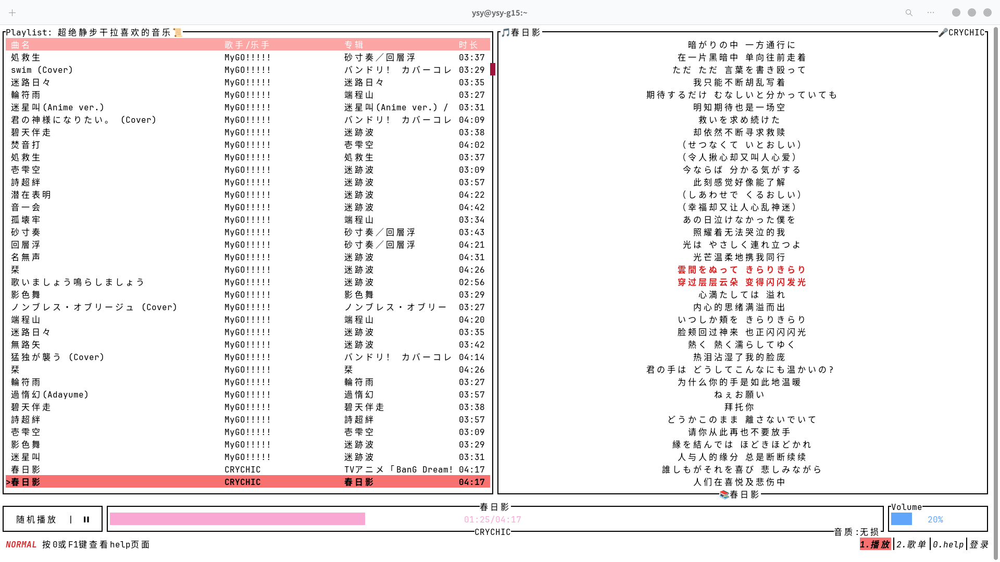
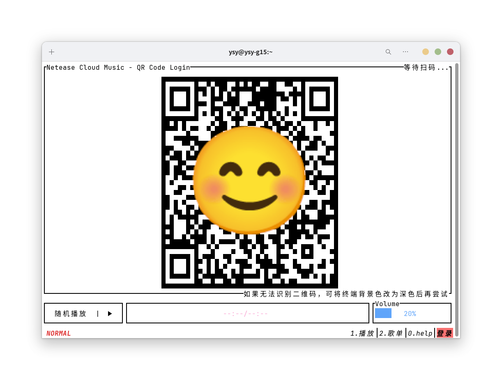

# NCM-TUI-Player


本项目是一款用 rust 编写的网易云音乐终端界面播放器。

提供仿 `Vim` 式的命令和交互体验。

欢迎提 Issue 或 PR :)

## UI 展示

### 启动界面


### 主界面


### 主界面（全屏）



### 登录界面

二维码



## Features

### 登录
- [x] 扫码登录
- [x] Cookie 登录

### 播放 / 歌词
- [x] 音量设置
  - [x] “一键静音”
- [x] 播放模式
  - [x] 单曲播放
  - [x] 单曲循环播放
  - [x] 列表循环播放
  - [x] 随机播放
- [x] “一键开始播放”
- [x] 歌词滚动显示
- [x] 跳转到某句歌词对应的时间戳播放

### 播放列表
- [x] 从用户创建的歌单创建播放列表
- [x] 在播放列表中跳转到当前播放的歌曲所在位置
- [x] 在播放列表中搜索歌曲名
  - [ ] 支持正则表达式

### 歌曲
- [ ] 全局搜索歌曲
- [ ] 歌曲操作
  - [ ] 喜欢 / 取消喜欢
  - [ ] 查看所属专辑
  - [ ] 查看歌手主页

### 其他
- [x] 本地 api + 远程 api
- [ ] 自定义Style
- [ ] 设置页面
- [ ] 用户数据缓存
- [ ] 打包分发
  - [ ] Linux (rpm)
  - [ ] Linux (deb)
  - [ ] Linux (flatpak)
  - [ ] MacOS
  - [ ] Windows

## 依赖和安装

本项目依赖上游的 `neteasecloudmusicapi` 程序（为nodejs程序），支持两种模式
- `local api` 模式，依赖程序部署在本地
  - 访问速度很快，没有账号安全隐患
  - 需要在本地部署依赖程序，占用较大存储空间（100MB左右）（此外还需要nodejs环境），运行时也需占用额外内存
- `remote api` 模式，依赖程序部署在服务器
  - 本地无需安装大量依赖，节省空间，快捷部署
  - 依赖程序部署在服务器，本项目提供了默认的公开服务器，但访问速度较慢（性能较弱）（**如果您有空闲服务器，也欢迎提供**）
  - 如果使用第三方部署的 remote api ，可能存在安全隐患

### 对于 local api 模式

依赖如下：
- [Gstreamer](https://gstreamer.freedesktop.org/download)
- [nodejs 14+](https://nodejs.org/)
- [netease-cloud-music-api](./bin/neteasecloudmusicapi.zip)

#### 1. 自行准备 nodejs 和 npm 环境

nodejs 版本 >= 14

#### 2. 解压 netease-cloud-music-api

请将项目 `bin` 目录下的 `neteasecloudmusicapi.zip` 解压到对应操作系统的指定路径:

|   OS    |                            解压到                             |
|:-------:|:----------------------------------------------------------:|
|  Linux  |         /home/`$USER`/.local/share/ncm-tui-player/         |
|  MacOS  | /Users/`$USER`/Library/Application Support/ncm-tui-player/ |
| Windows |   C:\\Users\\`$USER`\\AppData\\Roaming\\ncm-tui-player\\   |

解压后的文件树如下：

```
ncm-tui-player
└── neteasecloudmusicapi
    ├── app.js
    ├── CHANGELOG.MD
    ├── data
    ├── ...
    └── yarn.lock
```

#### 3. 安装 netease-cloud-music-api

切换到步骤 `2.` 中的目录，执行

```shell
cd neteasecloudmusicapi
npm install
```

#### 4. 安装 Gstreamer

本项目至少需要 `gstreamer-base` `gstreamer-good` 和 `gstreamer-bad` 组件，
请参考 [官方文档](https://gstreamer.freedesktop.org/documentation/installing/index.html?gi-language=c) 自行安装对应系统的版本。

### 对于 remote api 模式

依赖如下：
- [Gstreamer](https://gstreamer.freedesktop.org/download)

Gstreamer 的安装与 `local api` 模式下相同。

## 运行说明

运行时需要将 `stderr` 输出重定向。参考 `./bin/ncm-tui-player.sh` 脚本。

## 编译

除了使用本项目提供的打包，也欢迎您选择在本地自行编译。

### 1. Windows 下安装 Gstreamer 并编译本项目

根据 [Gstreamer 官方文档](https://gstreamer.freedesktop.org/documentation/installing/on-windows.html?gi-language=c) ，
需要安装 Gstreamer 的开发环境和运行时环境，此处注意选择的版本应与你的 rust 工具链使用的编译环境相同：
- 如果你的 rust 工具链使用了 `MSVC` ，则需要下载 Gstreamer 的 `MSVC 64-bit runtime installer` 和 `MSVC 64-bit development installer`
- 如果你的 rust 工具链使用了 `MinGW` ，则需要下载 Gstreamer 的 `MinGW 64-bit runtime installer` 和 `MinGW 64-bit development installer`

安装时选择 `Typical` 配置即可。

安装后需要设置一些环境变量，以下演示中均以 Gstreamer 选择 `MSVC 64-bit` 版本且安装在 `C:\gstreamer` 路径的情况为例：
- `Path` 变量中加入 Gstreamer 的 bin 目录 `C:\gstreamer\1.0\msvc_x86_64\bin`
- 新建 `GST_PLUGIN_PATH` 变量，值为 Gstreamer 的插件目录 `C:\gstreamer\1.0\msvc_x86_64\lib\gstreamer-1.0`

至此 Gstreamer 安装完毕。

在编译本项目前需要设置 `PKG_CONFIG_PATH` 环境变量（永久或临时均可）为：
`C:\gstreamer\1.0\msvc_x86_64\lib\pkgconfig;C:\gstreamer\1.0\msvc_x86_64\lib\gstreamer-1.0\pkgconfig` （包含2个目录）。

## 参考项目

https://gitlab.com/jcheatum/rmup

https://github.com/aome510/spotify-player

https://github.com/Rigellute/spotify-tui

https://github.com/sudipghimire533/ytui-music

https://github.com/tramhao/termusic