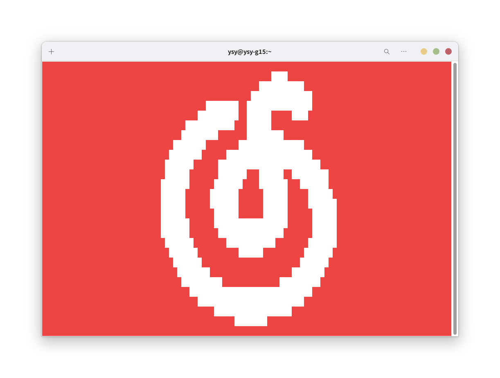
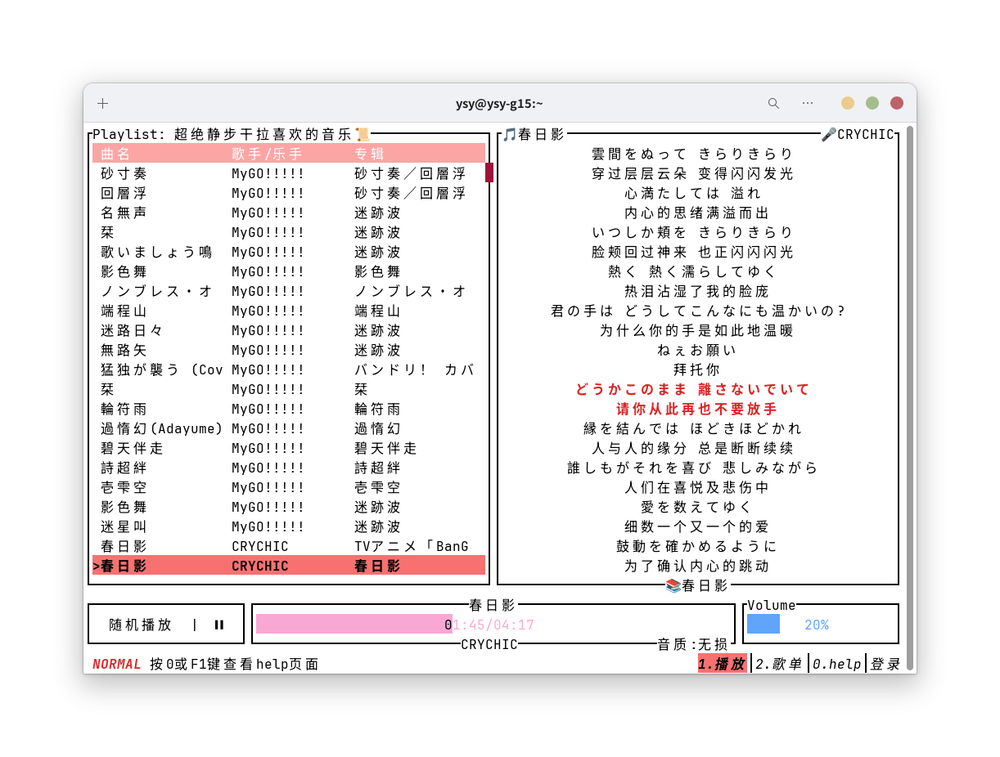

# ncm-tui-player

本项目是一款用 rust 编写的网易云音乐终端界面播放器。

提供与 `Vim` 相仿的命令和交互。

tui 界面基于 `ratatui` crate 开发。

## UI 展示





## 依赖

### [nodejs 14+](https://nodejs.org/)

### [netease-cloud-music-api](./bin/neteasecloudmusicapi.zip)

### [Gstreamer](https://gstreamer.freedesktop.org/download)

## 安装依赖

### 1. 自行准备 nodejs 和 npm 环境

nodejs 版本 >= 14

### 2. 解压 netease-cloud-music-api

请将项目 `bin` 目录下的 `neteasecloudmusicapi.zip` 解压到对应操作系统的指定路径:

|   OS    |                            解压到                             |
|:-------:|:----------------------------------------------------------:|
|  Linux  |         /home/`$USER`/.local/share/ncm-tui-player/         |
|  MacOS  | /Users/`$USER`/Library/Application Support/ncm-tui-player/ |
| Windows |   C:\\Users\\`$USER`\\AppData\\Roaming\\ncm-tui-player\\   |

解压后的文件树如下：

```
ncm-tui-player
└── neteasecloudmusicapi
    ├── app.js
    ├── CHANGELOG.MD
    ├── data
    ├── ...
    └── yarn.lock
```

### 3. 安装 netease-cloud-music-api

切换到步骤 `2.` 中的目录，执行

```shell
cd neteasecloudmusicapi
npm install
```

### 4. 安装 Gstreamer

理论上本项目只需要 gstreamer 和 gstreamer-base 组件。

各平台下的安装手册有待补充，可以参考[官方文档](https://gstreamer.freedesktop.org/documentation/installing/index.html?gi-language=c)自行安装。

## 运行说明

运行时需要将 `stderr` 输出重定向。

## Features 列表

- [x] 扫码登录
- [x] Cookie 登录
- [x] 获取用户的“喜欢的音乐”歌单
- [ ] 获取用户收藏的歌单
- [ ] 切换歌单
- [ ] 通过api搜索歌曲
- [ ] 查看专辑
- [ ] 查看歌手
- [ ] 喜欢 / 取消喜欢 / 收藏 / 取消收藏
- [ ] 加入当前播放列表 / 下一首播放
- [x] 歌词显示
- [x] 音量设置 / “一键静音”
- [x] 单曲播放 / 单曲循环播放 / 列表循环播放 / 随机播放
- [x] “一键开始播放”
- [x] 下一首 / 上一首
- [x] 跳转到某句歌词对应的时间戳播放
- [x] 在歌单中跳转到当前播放的歌曲所在位置
- [x] 在歌单中搜索歌曲名
- [ ] 使用正则表达式搜索歌曲名
- [ ] 自定义Style
- [ ] 设置页面
- [ ] 用户数据缓存
- [ ] Linux各发行版和Windows打包分发

欢迎提 Issue 或 PR :)

## 参考项目

### api 参考：

https://github.com/gmg137/netease-cloud-music-api

https://github.com/gmg137/netease-cloud-music-gtk

### tui 参考：

https://gitlab.com/jcheatum/rmup

https://github.com/aome510/spotify-player

https://github.com/Rigellute/spotify-tui

https://github.com/sudipghimire533/ytui-music

https://github.com/tramhao/termusic